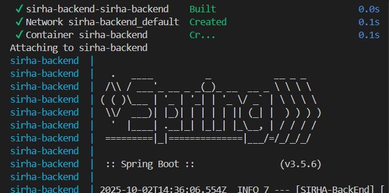

#  SIRHA – BackEnd

## Tecnologías Utilizadas

- Java 17+
- Spring Boot
- Maven (gestión de dependencias y compilación)
- Swagger UI (documentación de la API)
- JaCoCo (análisis de cobertura de pruebas)
- SonarQube (análisis estático de código)

---

##  Estrategia de Versionamiento y Branches

###  Versionamiento

* Se usará **Semantic Versioning (SemVer)**:

  * **MAJOR**: cambios incompatibles con versiones anteriores.
  * **MINOR**: nuevas funcionalidades compatibles.
  * **PATCH**: correcciones de bugs y ajustes menores.

Ejemplo: `v1.2.3`

* `1` → versión mayor.
* `2` → nuevas funcionalidades.
* `3` → correcciones menores.

---

### Branches (Git Flow Simplificado)

* **`main`** → contiene el código estable en producción.
* **`develop`** → rama de integración, donde se unen todas las funcionalidades antes de pasar a producción.
* **`feature/<nombre>`** → ramas para nuevas funcionalidades. Se crean desde `develop` y se fusionan de nuevo en `develop`.
* **`release/<versión>`** → rama para preparar entregas, pruebas finales y documentación antes de pasar a `main`.
* **`hotfix/<nombre>`** → rama para correcciones críticas que deben aplicarse directamente a `main` y luego integrarse en `develop`.

## Estado del Proyecto

🔧 Proyecto en fase de planeación. Actualmente en construcción de estructura base (scaffolding), diseño técnico y documentación inicial.

- ✅ **API REST básica** - Implementada
- ✅ **Modelo de dominio** - Implementado
- ✅ **Integración MongoDB** - Configurada
- ✅ **Documentación Swagger** - Configurada
- ✅ **Docker/Docker Compose** - Configurado


SIRHA Backend es una API REST desarrollada con Spring Boot que gestiona el sistema de información de recursos humanos y administrativos. El sistema permite la gestión de estudiantes, grupos, solicitudes académicas y procesos de autenticación.

## Estructura del Proyecto Planeada (Scaffolding MVC)

El proyecto se desarrollará bajo el patrón **MVC (Modelo - Vista - Controlador)**. Esta será la estructura básica:

```plaintext
sirha-backend/
|── docs/
|    |── uml/
|    |── imagenes/
├── src/
│   ├── main/
│   │   ├── java/edu/dosw/sirha/
│   │   │   ├── controller/      # Controladores REST (endpoints)
│   │   │   ├── service/         # Lógica del negocio
│   │   │   ├── model/           # Entidades y modelos de datos
│   │   │   ├── repository/      # Acceso a base de datos (JPA)
│   │   │   └── SirhaApplication.java
│   │   └── resources/
│   │       ├── application.properties
│   │       └── ...
│   └── test/                    # Pruebas unitarias e integración
|── pom.xml                    # Archivo de configuración de Maven
|── .gitignore
|── README.md                  # Readme donde están las evidencias de pruebas y ejecutables

src/
├── main/
│   ├── java/edu/dosw/sirha/SIRHA_BackEnd/
│   │   ├── SirhaBackEndApplication.java       # Clase principal Spring Boot
│   │   ├── config/                            # Configuraciones
│   │   │   ├── SecurityConfig.java           # Configuración de seguridad
│   │   │   └── SwaggerConfig.java            # Configuración de documentación API
│   │   ├── controller/                        # Controladores REST
│   │   │   ├── AuthController.java           # Endpoints de autenticación
│   │   │   ├── StudentController.java        # Gestión de estudiantes
│   │   │   ├── GroupController.java          # Gestión de grupos
│   │   │   └── RequestController.java        # Gestión de solicitudes
│   │   ├── domain/                           # Lógica de negocio
│   │   │   ├── model/                        # Entidades del dominio
│   │   │   └── port/                         # Interfaces (puertos)
│   │   ├── dto/                              # Data Transfer Objects
│   │   ├── service/                          # Interfaces de servicios
│   │   │   └── impl/                         # Implementaciones de servicios
│   │   ├── repository/                       # Acceso a datos
│   │   │   └── mongo/                        # Repositorios MongoDB
│   │   └── util/                             # Utilidades
│   └── resources/
│       └── application.properties            # Configuración de la aplicación
└── test/                                     # Tests unitarios e integración
```

### **Explicación de las Capas de Arquitectura**

#### **Capa de Dominio** (`domain/`)
La capa de dominio es donde se modelan los conceptos clave del sistema. Aquí se definen las entidades del sistema (como `Student`, `User`, `Group`, etc.) y las reglas de negocio fundamentales.

**Características:**
- Contiene las entidades centrales del negocio
- Define las reglas y validaciones del dominio
- Es independiente de tecnologías externas
- Representa el "corazón" del sistema

**Ejemplo**: La clase `Student` define qué es un estudiante, sus propiedades (código, semáforo académico) y sus comportamientos (inscribirse en grupos, realizar solicitudes).

####  **Capa de Repositorio** (`repository/`)
Los repositorios son la capa encargada de interactuar con la base de datos. Esta capa es responsable de obtener y almacenar datos de las entidades (como `Student`, `User`, etc.).

**Características:**
- Abstrae el acceso a datos
- Implementa el patrón Repository
- Maneja la persistencia en MongoDB
- Proporciona métodos CRUD básicos

**Ejemplo**: `StudentRepository` maneja todas las operaciones de base de datos relacionadas con estudiantes (guardar, buscar, eliminar).

#### **Capa de Servicios** (`service/`)
Los servicios contienen la lógica de negocio y orquestan el flujo de operaciones entre el repositorio y el controlador. Esta capa no tiene acceso directo a la base de datos, sino que se comunica a través de los repositorios. Además, los servicios suelen hacer la validación de la lógica de negocio.

**Características:**
- Contiene la lógica de negocio compleja
- Coordina operaciones entre múltiples repositorios
- Valida reglas de negocio antes de persistir
- Es reutilizable por diferentes controladores

**Ejemplo**: `StudentService` valida que un código de estudiante sea único antes de crear un nuevo estudiante, coordina con otros servicios para verificar prerrequisitos.

#### **Capa de Controladores** (`controller/`)
Los controladores gestionan las solicitudes HTTP que recibe la API REST. Están expuestos públicamente a través de rutas HTTP como GET, POST, PUT, etc. Cada controlador recibe las solicitudes del cliente, las valida y delega la lógica a los servicios.

**Características:**
- Maneja las peticiones HTTP entrantes
- Define los endpoints de la API REST
- Convierte entre DTOs y entidades
- Retorna respuestas HTTP apropiadas

**Ejemplo**: `StudentController` expone endpoints como `GET /api/students` y delega la lógica a `StudentService`.

#### **DTOs (Data Transfer Objects)** (`dto/`)
Los DTOs (Data Transfer Objects) son objetos que sirven para transportar datos entre las capas de la aplicación, especialmente entre la capa de servicio y el cliente.

**¿Por qué usar DTOs?**
Los DTOs sirven para **no exponer las entidades directamente** al usuario. Las entidades del dominio pueden tener datos internos que no queremos compartir, o tal vez queremos enviar solo una parte de los datos de una entidad.

**Ejemplo práctico**: 
- **Entidad `Student`**: Contiene `id`, `username`, `passwordHash`, `codigo`, `planGeneral`, `semaforo`, `solicitudes`
- **DTO `StudentDTO`**: Solo expone `id`, `username`, `codigo` y `solicitudesIds`

De esta forma, el cliente recibe solo la información necesaria sin exponer datos sensibles como el `passwordHash` o estructuras internas complejas.

#### **Capa de Utilidades** (`util/`)
Contiene clases helper y utilitarias que proporcionan funcionalidades comunes reutilizables en todo el sistema.

**Ejemplo**: `MapperUtils` para conversión entre entidades y DTOs, `PasswordUtils` para manejo seguro de contraseñas.

#### **Capa de Configuración** (`config/`)
Contiene las configuraciones específicas de Spring Boot para seguridad, documentación, base de datos, etc.

**Ejemplo**: `SecurityConfig` configura la seguridad del sistema, `SwaggerConfig` configura la documentación de la API.


## Comandos

    compilar ->  mvn clean compile/verify

    ejecutar ->  mvn spring-boot:run

    pruebas  ->  mvn test

    swagger  -> http://localhost:8080/swagger-ui/index.html


## Dockerización

El proyecto SIRHA está preparado para ejecutarse dentro de contenedores Docker, lo que facilita su despliegue en diferentes entornos sin necesidad de configurar dependencias locales.

compila el proyecto con Maven y genera una imagen ligera con el JAR final.

Docker Compose: permite levantar fácilmente el backend y conectarlo con MongoDB Atlas.

Variables de entorno: la configuración sensible (como SPRING_DATA_MONGODB_URI) se gestiona mediante el archivo .env, evitando exponer credenciales en el código.

Healthcheck: se valida automáticamente la disponibilidad de la aplicación a través del endpoint /actuator/health.

http://localhost:8080/actuator/health


Esto garantiza que la aplicación sea portable, reproducible y lista para producción, manteniendo buenas prácticas de despliegue continuo.

http://localhost:8080/swagger-ui.html



